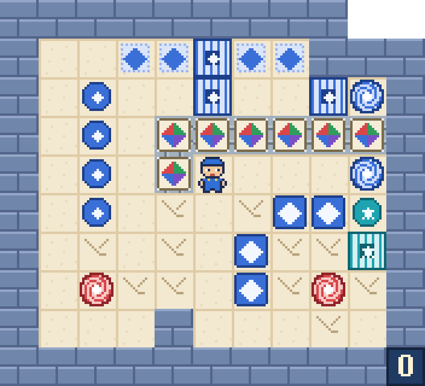

# Entrada forzada

Una cámara sellada: tres puertas que solo se abren juntas, cuatro placas que hay que cubrir a la vez, dos pares de
portales, una fila de cajas comodín sobre vías, suelo frágil y agujeros. Cuatro cajas azules tienen que llegar a
sus cuatro dianas. Juego web autónomo en **PuzzleScript Next**, con
pixel-art 16-bit propio y tarjetas ilustradas con todas las reglas.

## Cómo se juega
- **Objetivo:** lleva las cuatro cajas azules a las cuatro dianas azules. Una caja en su diana se ribetea de oro.
- **Flechas:** mover · **Z:** deshacer · **R:** reiniciar.
- **En el móvil:** desliza el dedo para moverte; deshacer y reiniciar están arriba a la derecha.
- **Vías:** las cajas solo van a lo largo de ellas (rectas y curvas); el mozo pasa por encima.
- **Portales:** cada uno lleva a su gemelo del mismo color (rojo con rojo, azul con azul); si el gemelo está ocupado, quien entra espera encima y sale solo.
- **Placas y puertas:** las tres puertas azules se abren a la vez cuando las cuatro placas azules están cubiertas; mientras algo ocupe una puerta abierta, ninguna se cierra. La placa y la puerta turquesa van aparte.
- **Caja comodín:** tapa agujeros y cubre placas; no tiene diana.
- **Suelo frágil:** aguanta una pasada del mozo y deja un agujero. Si el mozo cae en un agujero, la partida se acaba: hay que reiniciar o deshacer.
- **Ayudas** (arriba a la derecha): el **ojo**, **reiniciar**, **deshacer** (un movimiento atrás cada vez) y **solución** (reinicia y la reproduce, un movimiento cada 0,7 segundos; pulsada otra vez hace pausa, y con ella salen **atrás** y **adelante**, de movimiento en movimiento). Una tecla o un toque en el tablero devuelve el mando al jugador.
- **Final:** al resolver el puzzle, la imagen final no desaparece: se queda hasta que pulses **reiniciar** (la tecla R o el botón) o **deshacer** (para probar otra solución).

## Créditos
- Recreación, arte 16-bit y tarjetas: **Spider** (Fali + Claude), 2026
- Nivel original: Adamo («Forced Entry», sokobanonline.com)
- Motor: [PuzzleScript Next](https://github.com/david-pfx/PuzzleScriptNext) (derivado de PuzzleScript de increpare), incrustado en un único `index.html`
- Fuente del juego: [`juego.txt`](juego.txt)
